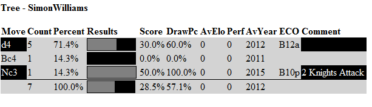

# Using the Repertoire Feature

ScincNet includes a feature to help creating and using opening repertoires.

This allows you to create two repertoires, one as White and one as Black.

## How are they stored?

The repertoires are stored in the folder **Documents\ScincNet\repertoire**. They consiste of three elements:

- Scid bases holding the moves called **WhiteRep** and **BlackRep**.
- The repertoire tree in JSON format in the files **whte.json** and **blck.json**.
- Text files holding a list of issues found in the repertoires, if any, called **whteerrs.txt** abd **blckerrs.txt**.

Two small reertoires are provided in the installation.

## The Repertoire menu

THe repertores can be displayed in the tree panel. To show them you use the **Show White** and **Show Black** options. These are also available as buttons on the toolbar.

To create the repertoire you just add games and moves to the relevant database and then update the repertoire using the **Update White** and **Update Black** options. 
If the update has issues these will be added to the relevant errors file so that you can review them and revise the games in the database.

## Displayimg the Repertoire

To display the repertoire first open a database of games. This will populate the tree. If you now select **Show Black**, the moves form the repertoire will be displayed in black cells.
Any move assessments and comments will also be shown. For example:

